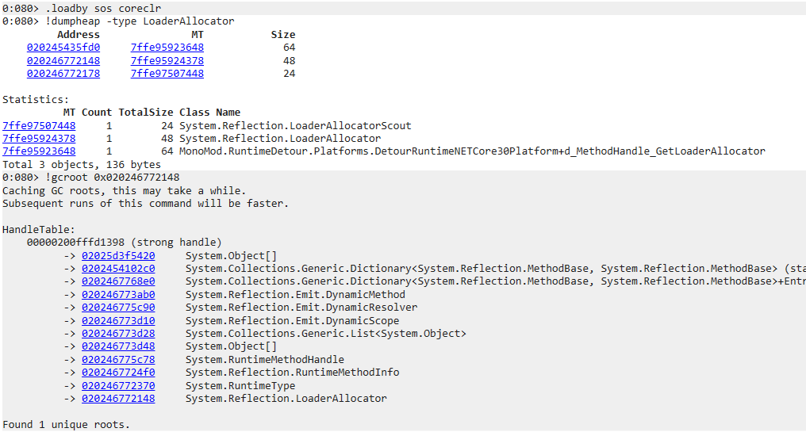

# Dynamic Loader
IL2CPP BepInEx 6 plugin that compiles, loads and unloads other plugins.

## How to use
[Create a plugin](https://docs.bepinex.dev/master/articles/dev_guide/plugin_tutorial/index.html) and put the source files in the BepInEx `plugins` folder,
or create a shortcut to your plugin source and put the shortcut in the `plugins` folder.

Once in-game press `F5` to compile and load plugins, and `F6` to unload them.

## How it works
The plugin searches the `plugins` folder for source files, folders with source files or shortcuts (`.lnk` on Windows) to these.  
It then compiles the found plugin(s) into in-memory assemblies that BepInEx then loads as usual.  

The assemblies are loaded using `AssemblyLoadContext`s, which supports unloading if the `GC` can properly remove all references to the assemblies.

## Unloadability
Unloadability of any plugin is heavily reliant on the plugin cleaning up after itself, as any references to the in-memory assemblies will prevent it from unloading properly.
Examples of references that need to be taken into account are:
* `MonoBehaviour`s added through `AddComponent<T>()`.  
  Use `UnityEngine.Object.Destroy()` to remove your behaviour from Unity's lifecycle.
* Instances of your classes that you've added to the games logic.
* `HarmonyPatch`es. `HarmonyLib` keeps a lot of internal references to your patches, even after `UnpatchSelf()`.  
  It is currently unclear if these internal references can be manually cleaned up.

### BepInEx unload support
There is currently no native unload support from BepInEx, and it does not respect `AssemblyLoadContext.Unloading` events.  
This plugin tries to manually remove internal BepInEx references to dynamically loaded plugins, but these methods will surely break as BepInEx is updated.

### Troubleshooting unloadability problems
It is essentially impossible to find what holds a reference to your plugin at runtime,
but [debugging with WinDbg](https://learn.microsoft.com/en-us/dotnet/standard/assembly/unloadability) can give you hints on where to look.

WinDbg showing a reference that is keeping an `AssemblyLoadContext` from unloading:

